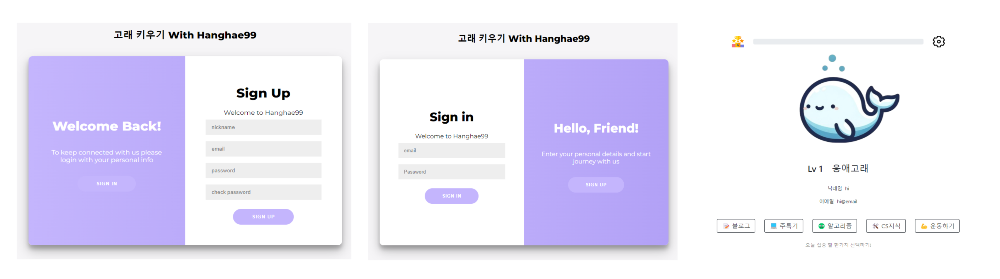
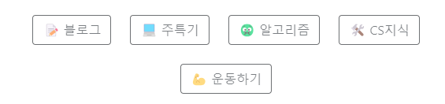
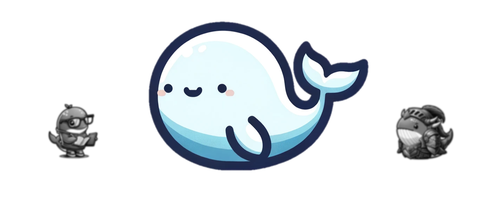

## v1.0.1
테스트

## v1.0.0

  

<h1 align="center">🐳 고래 키우기</h1>
<h4>항해99 18기 5조 미니프로젝트</h4>
매일매일 고래에게 ‘공부’ 먹이를 주고, 항해 99일간 키우면 성장 완료!

## 💻 preview
배포주소 :[woo3145.pythonanywhere.com](https://woo3145.pythonanywhere.com/)  

[고래키우기 시연 영상](https://youtu.be/D-ZuqNl9Zzk) 

## 👨‍👨‍👧‍👦 팀원
- [김기민](https://github.com/js1171) - 회원가입
- [김진욱](https://github.com/naraspc) - JWT, 로그인 구현
- [이지선](https://github.com/js1171) - 메인로직
- [이창우](https://github.com/woo3145) - 프로젝트 총괄 관리, 메인페이지

## 기능

고래의 밥!

- 고래에게 줄 밥을 하나 클릭!
- 밥은 하루에 한 번만 줄 수 있음

고래 진화!

 **Level 1 : 응애 고래**
    
- 회원 가입 후 나오는 첫 번째 고래
- 먹이를 주면 성장!

진화

- 99일의 최종 Level은 Lv5
- 먹이 종류에 따라 성장 형태 변화
- 진화하는 과정은 비밀~

 

로그인 / 회원가입

- JWT토큰을 사용한 인증처리

## 🛠️ Stack

### Backend
- 언어: `Python`
- 프레임워크: `Flask`
- DB: `SQL3LITE`
- ORM: `SQLALCHEMY`
- 인증: `JWT`
- 배포: `AWS-S3`, `PythonAnyWhere`

### Front
- 언어: `JavaScript`, `HTML`
- CSS: `Bootstrap`
- 템플릿 엔진: `Jinja2`
